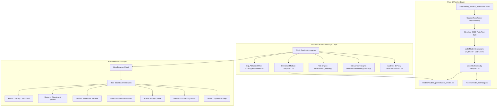
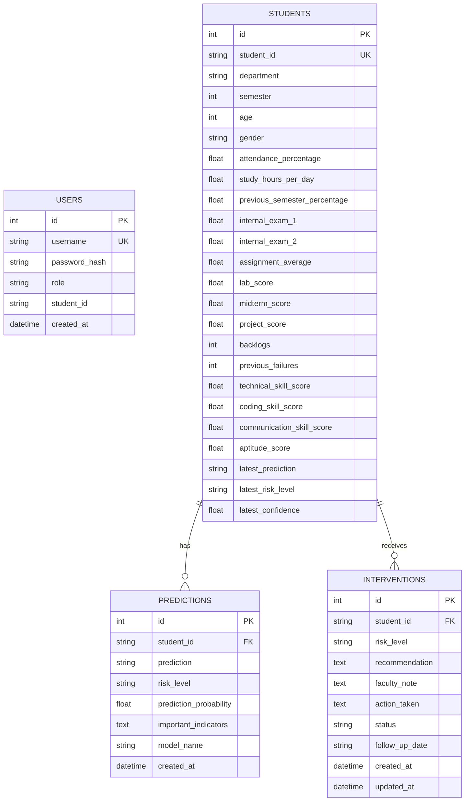

# Academic Project Technical Documentation

# AI-Based Engineering Student Performance Prediction and Early Intervention System

---

## 1. ABSTRACT
In modern higher technical education, student academic failure, dropout rates, and uncleared course backlogs pose severe challenges to students, educators, and institutional accrediting bodies. Traditional mentoring practices in engineering colleges typically rely on retrospective evaluation—analyzing failures after semester-end examinations have concluded—precluding timely remediation.

This project presents an end-to-end, production-style Artificial Intelligence and Machine Learning web application specifically engineered for engineering colleges. The system continuously evaluates multi-dimensional academic, continuous-assessment, and behavioral indicators across eight engineering departments. Utilizing a multi-classifier benchmark (Logistic Regression, Decision Tree, Random Forest, Gradient Boosting, and Support Vector Machines), the system predicts final academic performance categories (`High`, `Average`, `Low`) without target leakage. Furthermore, an integrated transparent Risk Engine classifies students into actionable risk tiers (`LOW RISK`, `MEDIUM RISK`, `HIGH RISK`), while an Early Intervention Engine provides rule-based, individualized remedial recommendations. Developed with Flask, SQLAlchemy, Scikit-Learn, and Plotly.js, the system equips faculty mentors and administrators with real-time decision-support tools.

---

## 2. PROBLEM STATEMENT
Engineering curricula require cumulative mastery of mathematical rigor, technical skills, laboratory practices, and continuous assessments. Despite regular evaluations (internal exams, assignments, lab work), engineering institutions encounter:
1. **Late Risk Detection**: Academic deficits (e.g. attendance dips below 75%, failing internal assessments) often go unflagged until semester examinations.
2. **Disconnected Indicators**: Isolated examination records fail to correlate attendance, study dedication, backlogs, and practical coding abilities.
3. **Absence of Actionable Intervention**: Mere grade reporting fails to prescribe targeted remediation (e.g., programming labs vs. attendance advisories).
4. **Lack of Explainability**: Complex machine learning algorithms are frequently viewed as opaque "black boxes," hindering institutional trust.

---

## 3. PROJECT OBJECTIVES
The core objectives of the system are:
1. **Accurate Performance Classification**: Train and deploy a machine learning classification pipeline to predict engineering student outcomes into `High`, `Average`, or `Low` categories with weighted F1-score exceeding 80%.
2. **Target Leakage Prevention**: Enforce strict feature separation such that final outcome variables are excluded from predictive inputs.
3. **Transparent Risk Stratification**: Build a deterministic, multi-factor risk engine that stratifies students into Low, Medium, and High Risk tiers based on university regulations (e.g., 75% attendance threshold, active backlogs).
4. **Personalized Early Intervention Generation**: Formulate rule-based remedial recommendations tied directly to observed student deficits.
5. **Role-Based Web Dashboard**: Implement role-based access control (Admin, Faculty/Mentor, Student) with interactive visualizations powered by Plotly.js.
6. **Reproducible Engineering Benchmark**: Compare five standard algorithms using stratified validation and persist metrics dynamically.

---

## 4. EXISTING SYSTEM VS. PROPOSED SYSTEM

| Parameter | Existing System | Proposed EduVision AI System |
| :--- | :--- | :--- |
| **Evaluation Timing** | Post-facto (after final exam results) | Formative & Proactive (during active semester) |
| **Prediction Approach** | Manual heuristic / gut-feeling mentoring | Data-driven Scikit-Learn Machine Learning |
| **Model Selection** | None or single unbenchmarked model | 5-Model comparative benchmark with automated selection |
| **Risk Stratification** | Binary pass/fail or absent | 3-Tier Multi-factor transparent scoring (`Low`, `Med`, `High`) |
| **Interventions** | Generic warnings issued manually | Rule-based, actionable remedial plans tied to actual gaps |
| **Visualization** | Static spreadsheet tables | Dynamic Plotly.js charts (Spider radars, Donut, Heatmaps) |
| **User Portals** | Monolithic administrative reports | Segregated Admin, Faculty Mentor, and Student self-service |

---

## 5. SYSTEM ARCHITECTURE



---

## 6. DATA FLOW DIAGRAMS

### Level 0 DFD (Context Diagram)
```
[Faculty / Mentor / Admin]  ---> (Engineering Student Data) ---> [EduVision AI System]
[EduVision AI System]       ---> (Predictions, Risk & Action Plans) ---> [Faculty / Student]
```

### Level 1 DFD (Subsystem Breakdown)
```
[Input Student Record] 
       |
       v
(1.0 Feature Validation & Imputation) ---> [Imputed Features]
       |
       v
(2.0 Preprocessor Pipeline: Scaling & One-Hot) ---> [Transformed Vector]
       |
       v
(3.0 Model Inference) ---> [Predicted Class & Probabilities]
       |
       v
(4.0 Risk Engine Scoring) ---> [Risk Tier & Factors]
       |
       v
(5.0 Rule-Based Intervention Generator) ---> [Prioritized Remedial Plan]
       |
       v
(6.0 Database Storage & UI Presentation) ---> [Updated SQLite DB & Dashboard]
```

---

## 7. DATASET SPECIFICATIONS & ENGINEERING FEATURES
The dataset (`data/engineering_student_performance.csv`) consists of **1,250 anonymized engineering student records** across 8 engineering disciplines:
1. Computer Science and Engineering
2. Information Technology
3. Electronics and Communication Engineering
4. Electrical and Electronics Engineering
5. Mechanical Engineering
6. Civil Engineering
7. Artificial Intelligence and Data Science
8. Artificial Intelligence and Machine Learning

### Feature Dictionary

| Column Name | Type | Range / Values | Description | Role in ML |
| :--- | :--- | :--- | :--- | :--- |
| `student_id` | String | `ENG0001` - `ENG1250` | Unique anonymized student identifier | Identifier (Excluded) |
| `department` | String | 8 Engineering Branches | Branch of study | Categorical Feature |
| `semester` | Integer | 3 - 8 | Current academic semester | Numerical Feature |
| `age` | Integer | 18 - 25 | Student chronological age | Numerical Feature |
| `gender` | String | Male, Female, Other | Demographic attribute | Categorical Feature |
| `attendance_percentage`| Float | 45.0 - 99.5% | Classroom attendance percentage | Numerical Feature |
| `study_hours_per_day` | Float | 0.5 - 8.0 hrs | Self-reported daily study hours | Numerical Feature |
| `previous_semester_percentage`| Float | 40.0 - 98.0% | Prior cumulative percentage | Numerical Feature |
| `internal_exam_1` | Float | 25.0 - 99.0 | Continuous assessment test 1 score | Numerical Feature |
| `internal_exam_2` | Float | 25.0 - 100.0 | Continuous assessment test 2 score | Numerical Feature |
| `assignment_average` | Float | 40.0 - 100.0 | Average homework assignment marks | Numerical Feature |
| `lab_score` | Float | 40.0 - 100.0 | Hands-on laboratory performance | Numerical Feature |
| `technical_skill_score`| Float | 25.0 - 99.0 | Core engineering subject skills | Numerical Feature |
| `coding_skill_score` | Float | 20.0 - 98.0 | Programming & algorithm rating | Numerical Feature |
| `communication_skill_score`| Float | 30.0 - 98.0 | Soft skills & presentation rating | Numerical Feature |
| `aptitude_score` | Float | 25.0 - 98.0 | Analytical & quantitative skills | Numerical Feature |
| `backlogs` | Integer | 0 - 4 | Active uncleared subjects | Numerical Feature |
| `previous_failures` | Integer | 0 - 6 | Total past failed examination attempts| Numerical Feature |
| `class_participation` | Integer | 1 - 10 | Instructor participation rating | Numerical Feature |
| `extracurricular_score`| Float | 20.0 - 95.0 | Sports, clubs & symposium activities | Numerical Feature |
| `project_score` | Float | 35.0 - 99.0 | Mini-project / capstone rating | Numerical Feature |
| `midterm_score` | Float | 28.0 - 99.0 | Formal midterm examination mark | Numerical Feature |
| `final_exam_score` | Float | 25.0 - 99.0 | Semester-end examination outcome | **Ground Truth (Leakage Excluded)**|
| `performance_category`| String | `High`, `Average`, `Low` | Multi-class target label | **Target Variable** |

---

## 8. PREPROCESSING & LEAKAGE PREVENTION
1. **Target Leakage Prevention**: In predictive modeling, target leakage occurs when information from the final outcome is improperly made available during training. In this system, `final_exam_score` is strictly omitted from the feature matrix $X$. The model only observes variables known prior to the final examination.
2. **Numerical Pipeline**:
   - `SimpleImputer(strategy='median')`: Imputes missing or omitted values using median statistics computed strictly from the training partition.
   - `StandardScaler()`: Standardizes features by subtracting mean and scaling to unit variance ($\mu=0, \sigma=1$).
3. **Categorical Pipeline**:
   - `SimpleImputer(strategy='most_frequent')`: Imputes categorical attributes.
   - `OneHotEncoder(handle_unknown='ignore', sparse_output=False)`: Encodes branch and gender into orthogonal dummy variables.
4. **ColumnTransformer Integration**: Preprocessing is bound into a Scikit-Learn `Pipeline` object, preventing test-set data snooping.

---

## 9. MACHINE LEARNING METHODOLOGY & BENCHMARK RESULTS
Five distinct multi-class classification algorithms were trained and evaluated on an 80/20 stratified train-test split (1,000 train records, 250 test records):

### Benchmark Comparison Table (Actual Test Set Scores)

| Algorithm | Test Accuracy | Precision (Weighted) | Recall (Weighted) | F1-Score (Weighted) | Selection Status |
| :--- | :--- | :--- | :--- | :--- | :--- |
| **Random Forest** | **80.40%** | **82.24%** | **80.40%** | **80.62%** | **SELECTED OPTIMAL** |
| **Gradient Boosting** | 80.40% | 80.53% | 80.40% | 80.43% | Candidate Evaluated |
| **Decision Tree** | 78.40% | 80.11% | 78.40% | 78.68% | Candidate Evaluated |
| **Logistic Regression** | 77.20% | 79.41% | 77.20% | 77.49% | Candidate Evaluated |
| **Support Vector Machine**| 76.40% | 79.15% | 76.40% | 76.69% | Candidate Evaluated |

### Selection Criterion Rationale
**Random Forest** achieved the highest weighted F1-score (0.8062) and superior precision (82.24%). Crucially, on the minority `Low` performance cohort (20 test samples), Random Forest achieved **95.0% Recall** (19 out of 20 at-risk students correctly identified), making it exceptionally suited for early intervention where false negatives are costly.

### Confusion Matrix (Random Forest Deployed Pipeline)
```
                     Predicted High   Predicted Average   Predicted Low
Actual High (78)          66                 12                  0
Actual Average (152)      27                116                  9
Actual Low (20)            0                  1                 19
```

### Top Model Feature Importances (Gini Impurity Reduction)
1. `internal_exam_2`: 12.54%
2. `project_score`: 11.86%
3. `backlogs`: 10.71%
4. `previous_semester_percentage`: 9.03%
5. `lab_score`: 8.86%
6. `midterm_score`: 8.12%
7. `previous_failures`: 7.27%
8. `internal_exam_1`: 5.87%
9. `technical_skill_score`: 5.71%
10. `assignment_average`: 3.99%

---

## 10. TRANSPARENT RISK ENGINE DESIGN (`services/risk_engine.py`)
To ensure institutional trust, risk scoring is deterministic and auditable. A total risk score (0 to 100) is evaluated:

$$\text{Risk Score} = S_{\text{model}} + S_{\text{attendance}} + S_{\text{backlogs}} + S_{\text{prev}} + S_{\text{internals}} + S_{\text{study}} + S_{\text{skills}}$$

### Risk Thresholds:
- **`HIGH RISK`**: Risk Score $\ge 45$, OR active backlogs $\ge 2$, OR (predicted category is `Low` AND attendance $<75\%$).
- **`MEDIUM RISK`**: Risk Score $\ge 20$, OR backlogs $=1$, OR attendance $<75\%$, OR predicted category is `Low`.
- **`LOW RISK`**: Satisfactory performance, regular attendance ($\ge 75\%$), and no uncleared backlogs.

---

## 11. RULE-BASED EARLY INTERVENTION ENGINE (`services/intervention_engine.py`)

| Deficit Indicator | Specific Condition | Recommended Early Intervention | Action Plan |
| :--- | :--- | :--- | :--- |
| **Attendance** | $\text{Attendance} < 75\%$ | Monitor attendance and encourage regular class participation. | Notify mentor; issue attendance deficit warning; schedule weekly attendance check-ins. |
| **Study Habits** | $\text{Study Hours} < 2.0\text{ h/d}$ | Create a structured daily study schedule. | Mentor assists in drafting a 2-3 hour daily revision timetable with time-blocking. |
| **Backlogs** | $\text{Backlogs} > 0$ | Create a backlog-clearing study plan and provide additional academic support. | Assign peer tutor; organize weekend remedial doubt sessions; previous exam question solving. |
| **Assignments** | $\text{Assignment Avg} < 60$ | Provide additional assignments and monitor submission quality. | Homework review; provide sample solutions; offer formative resubmission opportunity. |
| **Coding Skill** | $\text{Coding} < 50$ (CS/IT/AI) | Provide additional programming practice. | Enroll in competitive programming lab; assign 3 algorithmic exercises weekly on portal. |
| **Technical Skill** | $\text{Technical} < 50$ | Provide additional laboratory and technical practice. | Mandate supplementary hands-on lab sessions under teaching assistant supervision. |
| **Communication** | $\text{Communication} < 50$ | Encourage communication and presentation practice. | Mini-seminar presentations and group discussions in regular tutorial hours. |
| **Internal Exams** | $\text{Internals Avg} < 50$ | Conduct remedial exam coaching and intensive conceptual review. | Review Test 1 & 2 exam papers; re-test key units before university examinations. |

---

## 12. DATABASE DESIGN & ENTITY SPECIFICATIONS
Database Engine: **SQLite** via **Flask-SQLAlchemy**.



---

## 13. USER INTERFACE & PRESENTATION MODULES
1. **Executive Dashboard (`/dashboard`)**:
   - 6 KPI summary cards displaying live student numbers and averages.
   - 6 interactive Plotly.js charts (Category Share, Risk Tiers, Department Distribution, Attendance Box Plots, Study Hours Histograms, Backlog Stacks).
   - Real-time preview table for immediate attention cases.
2. **Students Directory (`/students`)**:
   - Filterable by department, semester, risk tier, and text query.
   - Paginated table showing all academic parameters.
3. **Student 360° Profile (`/student/<student_id>`)**:
   - Individual student analytics, including a Plotly Polar/Radar Chart visualizing 6 core skill dimensions.
   - History of machine learning predictions and intervention progress logs.
4. **Interactive Prediction Form (`/predict`)**:
   - Accepts 20 academic/behavioral parameters with 1-click demo presets (`High`, `Average`, `At-Risk`).
   - Generates instantaneous ML predictions, calibrated confidence percentages, risk tags, and intervention plans.
5. **At-Risk Queue (`/at-risk`)**:
   - Filterable view dedicated exclusively to students flagged with High or Medium risk.
   - Modal action buttons allowing mentors to record remediation plans directly.
6. **Interventions Board (`/interventions`)**:
   - Tracks intervention lifecycle (`Pending` $\rightarrow$ `In Progress` $\rightarrow$ `Completed`).
   - Modal dialogs for updating faculty notes, actions taken, and follow-up dates.
7. **Model Performance Page (`/model-performance`)**:
   - Renders live training records, dynamic benchmark comparison table, confusion matrix heatmap, and feature importance bar charts.

---

## 14. TESTING & VERIFICATION SUMMARY
All 19 unit test cases passed with zero errors:
- **ML Pipeline**: Verified model loading, multi-class predictions, probability calibration, and missing-feature median imputation.
- **Risk Engine**: Verified correct assignment of Low, Medium, and High risk classifications across edge-case student profiles.
- **Intervention Engine**: Verified rule triggers across attendance deficits, backlogs, low study hours, and specialized coding gaps.
- **Flask Routes & Security**: Verified session management, unauthenticated redirects, role-based views, and REST API response contracts.

---

## 15. LIMITATIONS & FUTURE ROADMAP

### Current Limitations:
1. **Synthetic Educational Dataset**: Tested on 1,250 realistic synthetic student records generated using stochastic distributions. Real-world validation on actual university data is recommended prior to live campus deployment.
2. **Cross-Sectional Modeling**: Models individual semester outcomes rather than temporal trajectories over multi-year periods.

### Future Roadmap:
1. **Explainable AI with SHAP**: Integrating Shapley Additive Explanations for real-time local explanation waterfall graphs.
2. **Automated Notification Gateway**: SMS and email alerts sent to mentors and guardians when attendance drops below the 75% regulatory line.
3. **Learning Management System (LMS) Connectors**: Native LTI / REST connectors for Canvas, Moodle, and Blackboard.
4. **Deep Temporal Modeling**: Developing Recurrent Neural Networks (LSTM/GRU) to forecast 8-semester graduation trajectories.
5. **Mobile Application**: Native mobile app for students to monitor their skill development and check intervention action items.

---

## 16. CONCLUSION
The **AI-Based Engineering Student Performance Prediction and Early Intervention System** successfully demonstrates a practical, end-to-end machine learning platform tailored for engineering institutions. By uniting multi-classifier benchmarks, zero target leakage, transparent risk stratification, and actionable rule-based interventions, the application transforms raw academic data into timely mentoring interventions. The system is fully functional, aesthetically polished, and well suited for engineering final-year project demonstrations.
